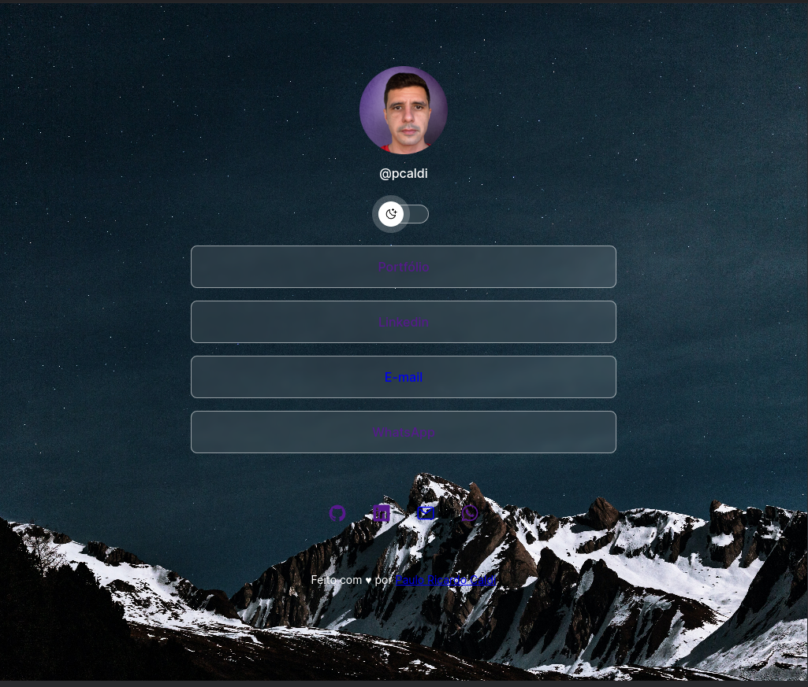
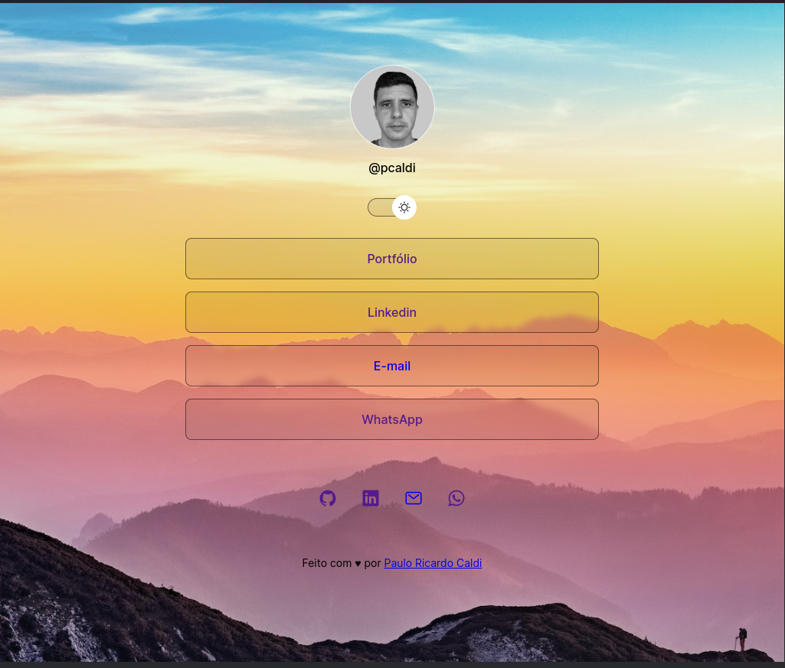

<h1 align="center">:file_cabinet:DevLinks</h1>

  

    
  

    
 

## :memo: Projeto

O DevLinks é um agregador de links para usar como cartão de visitas online.

## :wrench: Tecnologias utilizadas

- <a href="https://developer.mozilla.org/pt-BR/docs/Web/HTML" target="_blank">HTML</a>
- <a href="https://developer.mozilla.org/pt-BR/docs/Web/CSS" target="_blank">CSS</a>
- <a href="https://developer.mozilla.org/pt-BR/docs/Web/JavaScript" target="_blank">JavaScript</a>
- <a href="https://github.com/pcaldi" target="_blank">Git Github</a>
- <a href="https://figma.com" target="_blank">Figma</a>

## 📲 Contato

## :closed_book: Licença

Esse projeto possui [licença MIT](./LICENSE).
